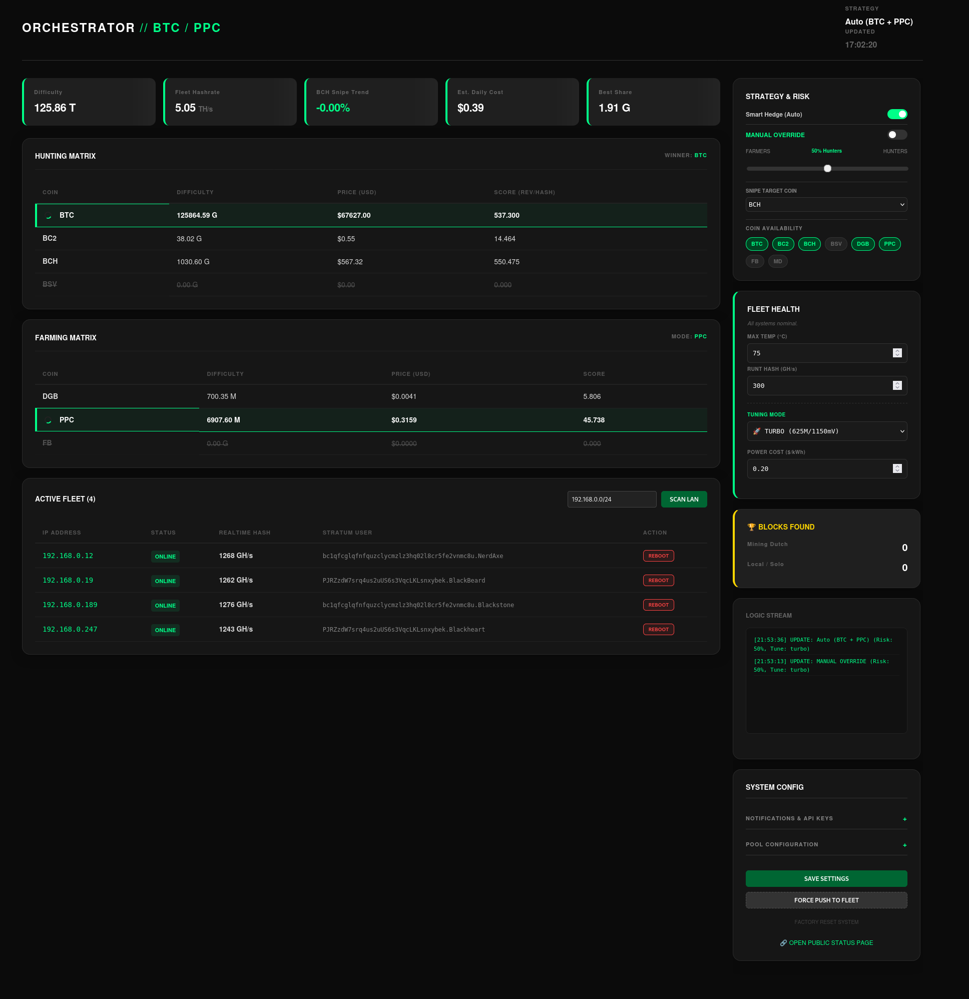

# OpenAxe Orchestrator ⛏️

**OpenAxe Orchestrator** is a lightweight, containerized fleet manager for **Bitaxe** ASIC miners. It automates profit switching, manages overclocking profiles, and detects "zombie" miners to ensure maximum uptime and profitability.

Built with Python (Flask) and vanilla HTML/JS/CSS for a fast, responsive, and dependency-free experience.



## 🚀 Key Features

* **Automated Profit Switching**: Continuously monitors difficulty and price across SHA-256 coins (BTC, BCH, BSV, DGB, PPC, FB, BC2) to determine the most profitable "Hunter" coin.
* **Strategy & Risk Management**: Use a slider to split your fleet between a high-profit "Hunter" coin and a stable "Farmer" coin (or pool like Mining Dutch).
* **Snipe Mode**: Automatically detects sudden difficulty drops (e.g., in Bitcoin Cash 2 or others) and switches the entire fleet to capitalize on easy blocks.
* **Auto-Tuning**: Switch your entire fleet between **Eco**, **Stock**, and **Turbo** modes instantly. The system handles frequency and voltage settings safely via the AxeOS API.
* **Zombie Detection**: Identifies miners that are hashing but not submitting shares (stuck stratum) and alerts you or reboots them.
* **Fleet Health Monitoring**: Watchdog for overheating and low hashrate ("Runt") miners.
* **Notification System**: Integrated support for **ntfy.sh** and **Nostr** for real-time alerts on block finds, offline miners, and strategy switches.

---

## 🛠️ Installation

### Option 1: Docker (Recommended)

1.  **Clone the repository:**
    ```bash
    git clone [https://github.com/OpenAxeProject/openaxe-orchestrator.git](https://github.com/OpenAxeProject/openaxe-orchestrator.git)
    cd openaxe-orchestrator
    ```

2.  **Configure Settings:**
    Copy the example settings file and edit it with your pool accounts.
    ```bash
    cp settings.json.example settings.json
    nano settings.json
    ```
    *See [Configuration](#configuration) below for details.*

3.  **Run with Docker Compose:**
    ```bash
    docker-compose up -d --build
    ```

4.  **Access the Dashboard:**
    Open `http://localhost:5404` (or your server's IP) in your browser.

### Option 2: Manual Install (Python)

1.  **Install Dependencies:**
    ```bash
    pip install -r requirements.txt
    ```
2.  **Run the App:**
    ```bash
    python app.py
    ```

---

## ⚙️ Configuration (`settings.json`)

The `settings.json` file controls your pools, API keys, and default behavior (a `settings.json.EXAMPLE` has been provided).

**Critical Fields:**
* **`pools`**: Define your stratum URL and User for each coin.
* **`mining_dutch_api_key`**: Required if you use Mining Dutch for multi-coin switching.
* **`power_cost_kwh`**: Your electricity cost (e.g., `0.12`) to calculate daily estimates.
* **`tuning_mode`**: Default startup profile (`eco`, `stock`, or `turbo`).

**Example Pool Config:**
```json
"pools": {
    "BTC": { "url": "stratum.kano.is:3333", "user": "yourwallet.worker" },
    "BCH": { "url": "stratum.antpool.com:3333", "user": "youruser.worker" }
}

```

---

## 🖥️ How to Use the Dashboard

### 1. The Strategy Slider

This is the heart of the orchestrator. It controls how your fleet is divided.

* **0% (All Farmers)**: 100% of miners work on the "Farmer" coin (usually a stable pool or long-term hold like FB).
* **50% (Split)**: Half the fleet mines the "Hunter" (highest profit), half mines the "Farmer".
* **100% (All Hunters)**: Full aggression. The entire fleet chases the most profitable coin of the moment.

### 2. Manual Override

Toggle this switch to bypass the automated logic.

* **Force Hunter**: Manually select which coin is the "Hunter".
* **Force Farmer**: Manually select which coin is the "Farmer".
* *Useful for: Maintenance, testing a specific pool, or accumulating a specific coin regardless of price.*

### 3. Tuning & Power

Located in the "Fleet Health" card.

* **🌱 Eco**: 485 MHz / 1100 mV (Max Efficiency, Low Heat).
* **⚖️ Stock**: 525 MHz / 1150 mV (Factory Balance).
* **🚀 Turbo**: 625 MHz / 1150 mV (Max Hashrate, Higher Power).
* *Note: Changing this sends an API command to every miner in the fleet. Allow 30-60 seconds for them to restart and apply.*

### 4. Coin Availability

Click the chips (BTC, BCH, BC2, etc.) to **Enable/Disable** them.

* **Disabled coins** will *never* be chosen by the auto-switcher, even if they are the most profitable.
* *Use case: A pool is down for maintenance, or you don't want to mine a specific shitcoin.*

### 5. Notifications

Toggle alerts on/off instantly without restarting:

* **Offline Alerts**: If a miner stops responding via API.
* **Switch Alerts**: When the fleet moves from one coin to another.
* **Zombie Alerts**: High hashrate but 0 shares found for >10 mins.
* **Block Found**: The holy grail. 🎉

---

## 🤖 Logic & Automation

The system runs a logic loop every **60 seconds**:

1. **Fetch Data**: Gets Difficulty and Price for all supported coins.
2. **Calculate Score**: `(Price / Difficulty) * Constant`.
3. **Determine Winner**: The coin with the highest score becomes the **Hunter**.
4. **Check Snipe**: If the `snipe_coin` (default BC2) difficulty drops by >15%, it overrides everything and triggers a **SNIPE** event (100% risk level).
5. **Apply to Fleet**:
* It checks every miner's current config.
* It only sends a reboot command if the miner is on the *wrong* pool or using the *wrong* settings.
* **Idempotent Design**: It will not reboot miners that are already correctly configured.


---

## ⚠️ Disclaimer

This software controls hardware voltages and frequencies. While the "Turbo" profile included is generally considered safe for Bitaxe Gamma units with proper cooling, **you use this software at your own risk**. Overclocking can damage hardware. Always ensure your power supply and cooling are adequate.

